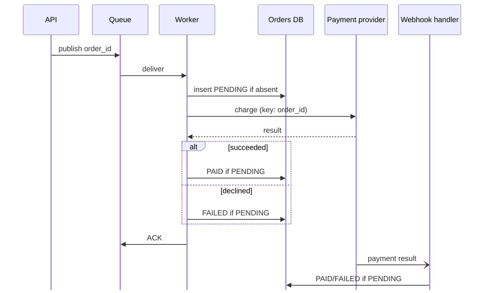

When we build a checkout flow, it's common to save the order, charge the customer with a payment provider, and then update the order with the result. It looks simple, but it hides a classic distributed systems problem: the dual-write problem.

It consists of having more than one system we write to in a given flow. This could be a DB and a third-party provider, but also other systems on the same cloud infrastructure, like a DB and a cache. Since these systems can't share a single transaction, there's no way to guarantee that all writes succeed or none do, so any failure between them can leave us in an inconsistent state.

Going back to our checkout flow, let's say an API handles it in three steps:

1. Insert the order in our DB as `PENDING`.
2. Charge the customer with the payment provider.
3. Update the order in our DB to `PAID`.

The API can die between any of these steps, or the charge can time out. Pick a scenario below to see the end state of each system, and keep the toggle on **Naive flow** for now.



## What each failure leaves behind

When all three steps succeed, both systems agree: the order is `PAID` and the customer was charged once. Let's start with the worst failure.

When the process dies after step 2, the customer was charged: the money left their account or was charged to their credit card. The business, on the other hand, has no visibility of that payment, and the order stays `PENDING`. It's a double bad experience for the customer: they paid, and nothing happens. Worse, they'll probably try again, and a new order means a new charge.

Dying after step 1 and before step 2 wouldn't be a problem by itself: the order is `PENDING` and nobody was charged. But how could we differentiate it from a timeout when calling the provider? It would be essentially the same. From our database, all three failures look identical, so we have to treat every `PENDING` order as possibly charged.

## Making the flow heal itself

Since we can't tell whether a `PENDING` order was charged, we don't try to guess. We make sure every order reaches a final state, `PAID` or `FAILED`, by retrying the flow until it gets a definitive answer, and we make those retries safe.

Instead of running the three steps inside the API request, the client generates the `order_id` (a UUID, for example) when the checkout starts and sends it to the API. The API publishes a message with it to a queue and returns, and a worker consumes the message and runs the three steps. Publishing is a single write, so the API itself has no dual-write problem: if the publish fails, nothing happened, and the client can retry. Since a retry carries the same `order_id`, it doesn't create a new order. The whole flow looks like this:

A few details make this work:

- **The message is only ACKed after the flow ends.** If the worker crashes, it can't ACK, so the queue redelivers the message and a worker retries the whole flow.
- **Every step must be safe to run again.** On redelivery the worker starts from step 1: the insert is skipped if the order already exists, and if the order is already `PAID` or `FAILED`, the worker just ACKs. The charge uses the `order_id` as the idempotency key, so if the provider already saw that key, it returns the result of the first request instead of charging the customer again.
- **Definitive answers end the flow.** If the charge succeeds, the worker marks the order as `PAID`; if it's declined, as `FAILED`. Only unknown outcomes, like a crash, a timeout, or a 5xx, are retried.
- **The webhook is a safety net.** It arrives at any time after the charge and covers the window where the customer was charged but the order is still `PENDING`.
- **The `order_id` also goes in the charge metadata.** The webhook only carries the idempotency key when our request triggered the event directly, while the metadata travels with the payment itself, so the webhook handler can always find the order.
- **Updates are conditional.** The worker and the webhook can race, so both only move the order forward if it's still `PENDING`. Whoever arrives second does nothing.

Now switch the widget above to **Self-healing flow** and replay the failure scenarios to see each one heal.

Once retries are exhausted, the message goes to a dead-letter queue (DLQ). While it sits there, the webhook still fixes the order if the customer was charged, and since the flow is idempotent, it's safe to reprocess the message later. What's left is monitoring: alert on the DLQ, and redrive before its retention expires, otherwise the message and the record of the pending work disappear.

Redriving has one catch: idempotency keys also expire at the provider (Stripe can remove them once they're 24 hours old). If the message is older than that, the retry could create a second charge. So before processing an old message, search the provider by the `order_id` in the metadata (Stripe's Search API supports `metadata['order_id']`), and only charge if there's no successful payment for it; if there is one, mark the order as `PAID`. Search results aren't real-time, which is fine here, since by then the payment is long indexed.

## Wrapping up

Every `PENDING` order is possibly charged, so the flow has to keep going until it gets a definitive answer. What makes that safe:

- ACK only after the flow ends.
- Use the same `order_id` everywhere: generated by the client, as the idempotency key, and in the metadata.
- Retry unknown outcomes, and end the flow on definitive ones.
- Use the webhook as a safety net.
- Only move an order forward if it's still `PENDING`.
- Monitor the DLQ.

This works because the API makes a single write: it only publishes a message. If your API needs to write to the DB and publish a message, look at the transactional outbox pattern. The outbox also delivers messages at least once, so the consumer still has to be idempotent.

Whenever we do one or more write operations on our system, having idempotency is a must in order to guarantee replayability, and help us out on doing reconciliation without needing to infer anything.
